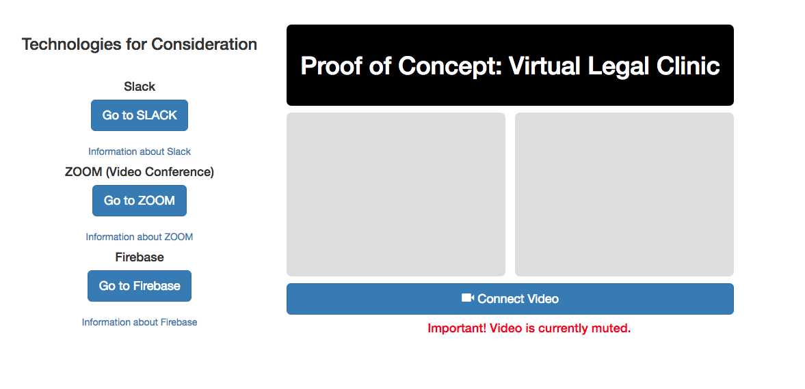

# Virtual Clinic Prototype | PHASE ONE
#### A Project Based on Insights from the Legal-Aid Hackathon 2018 | https://www.legalaidhackathon.org/
## IMPORTANT!! THIS PLATFORM IS FOR PROOF OF CONCEPT PURPOSES ONLY. THIS PLATFORM IS NOT TO BE USED FOR ANY LEGAL PURPOSE.

#### This Virtual Legal Clinic Prototype really arose as a result from working with two teams in the May 2018 Legal Aid Hackathon.  Both of these amazing teams were two of the *many* amazing teams who wanted to use technology to reach those who needed legal assistance.  

### HACKATHON

#### Project Idea | Jessica Rae
##### https://trello.com/c/eWme4aF4/149-description
#### Team: Abhijeet Chavan | Brian Stewart | Jessica Rae | Sharon Austin

```Every year, approximately 20,000 youth age-out of the foster care system throughout the U.S. The statistics on how youth fair after they leave foster care are grim. Compared to their peers, youth who age-out of foster care without being connected to caring and committed adults are less likely to complete their education and obtain employment that pays a living wage. They are at greater risk of homelessness, incarceration, becoming parents early and having their own children involved in the foster care system. Many are left to deal with the trauma they experienced at home or in the foster care system without adequate access to medical and mental health care.```

```To combat these dire outcomes, both federal and state laws have created rights and protections for this vulnerable population. However, many youth and those who advocate on their behalf are unaware of those rights or do not understand how to access them.```

```Florida, in accordance with federal law, has enacted several programs which provide access to health care, housing, education, social and financial support. However, the eligibility requirements for each program are specific and can depend on the youth's legal status at certain ages, the length of time the youth spent in certain placements, the youth's educational achievements and current age.```

```To help navigate this complicated system, we would like to create a chatbot that walks a youth and/or their advocate through questions to help determine eligibility for the various programs. Most of the questions could be answered with yes, no, or I don't know.```

```In an ideal world, this chatbot could be expanded to cover the entire U.S. and be available to all youth and young adults who have aged out of care.```


##### Special Thanks to: 
#### Abhijeet Chavan | Joseph Schieffer | Sam Harden | Brian Stewart | Jack Haycock | Jessica Rae | Kimi deMent | 

##### All teams were doing great things, and in all cases we found that members from one team would reach out to help another.  It so happened that my efforts focued on the work of two teams; Chatbot for Youth Aging Out Of Foster Care, and the Virtual Legal Clinic, as both wanted to use chatbots for outreach.  Below are more details for the two projects, from which the proof-of-concept for this repository rests.

### PHASE ONE

#### Project Idea | Kimi deMent
##### https://www.legalaidhackathon.org/blog/remote-virtual-legal-clinic?categoryId=47390
#### Team: Kimi deMent | Sharon Austin


#### In short, tasking was to take off-the-shelf technology and create a video-clinic that may reach the many who need legal help, but cannot afford to come to a lawyer's office.  There's many reasons a person needing help cannot access legal help, even though many, many lawyers want to reach out to those in need.   Health and wealth are two major barriers, that we feel, may be overcome with technology.   To that end, the video clinic must be:

1. Free
1. Mobile
1. Use a "mix" of authorization and authentication technologies and protocols.  Some technologies are wide open to ensure quick and easy access, so that even illiterate, ill, injured or isolated clients could talk to someone without a need to sign in, if necessary.  However, for long-term service, and especially for HIPAA and other privacy concerns,  authentication and authorization technologies are employed at different times and different locations.
1. Off the shelf technology is used.  For example, to upload documents, Slack is used; attendant to that is all the authentication technologies used by Slack.

```I am interested in building a remote connectivity platform (such as an app) that can be used to set up remote/virtual legal clinics specifically designed to service rural areas that LSC funded organizations could overlay into their existing intake/screenings, and non LSC funded organizations could also utilize. It would theoretically be set up so that the user would access either a web platform or app and would be guided through a series of plain-language questions on income, eligibility, etc.```

```The user would then be virtually connected with an "on-call" pro bono attorney (either in real time or by appointment) who would provide pro bono counsel and advice through the web portal on behalf of the legal services organization in the same way as if the person attended a traditional walk-in clinic. Ideally, the platform would be a secure connection (thus avoiding the problems of waiver of confidentiality) and the user could upload documents such as warrants, etc, directly into the screen through their smartphone or other web access device through photos, screenshots, or even just pointing the camera toward the document if they lacked technological sophistication.```

```Something that was built in plain language that is universally acceptable for an LSC org but was also available for other types of legal clinics (bar associations, non-LSC funded partners, etc) would be ideal. Preferably, no set-up would be required by the LSC org on the user side as the accessibility would be user-friendly and in plain language.```

```-Kimi deMent```


##### Project Reason/Description | https://trello.com/c/HTLXnoF7/143-reason

```Build a remote connectivity platform (such as an app) that can be used to set up remote/virtual legal clinics specifically designed to service rural areas that LSC funded organizations could overlay into their existing intake/screenings, and non LSC funded organizations could also utilize. It would theoretically be set up so that the user would access either a web platform or app and would be guided through a series of plain-language questions on income, eligibility, etc. The user would then be virtually connected with an "on-call" pro bono attorney (either in real time or by appointment) who would provide pro bono counsel and advice through the web portal on behalf of the legal services organization in the same way as if the person attended a traditional walk-in clinic. Ideally, the platform would be a secure connection (thus avoiding the problems of waiver of confidentiality) and the user could upload documents such as warrants, etc, directly into the screen through their smartphone or other web access device through photos, screenshots, or even just pointing the camera toward the document if they lacked technological sophistication. Something that was built in plain language that is universally acceptable for an LSC org but was also available for other types of legal clinics (bar associations, non-LSC funded partners, etc) would be ideal. Preferably, no set-up would be required by the LSC org on the user side as the accessibility would be user-friendly and in plain language.```


### PHASE TWO

##### Phase Two of the project started at the end of May.  Kimi DeMent recommended that certain technologies be highlighted, and others dropped.  For example, we found that Dialogflow, although a great solution for the Youth Aging Out of Foster Care project, was not really appropriate for the purposes of a Virtual Legal Clinic.   We wanted to test the use of Slack a little more as a means to put clients into individual rooms, and work with them from there.   At the time, too, we found that a technology called ZOOM could be incorporated into Slack, and we looked into that as a means of possibly getting into Slack and into a video conference.  We also looked into a technology called Discord, because of its ability to use voice, but it was not secure enough for use with clients.   A screenshot of the next iteration may be seen below.



##### The overarching point of developing a web page incorporating these technologies was to try to develop a platform that was free to use.   The main sticking point is that it was to be HIPAA compliant, and for various reasons, that was going to require funds.

##### On July 20, Phase Two was completed. We had a WebEx meeting with several lawyers and law students, and decided against the platform in favor of another, new platform called, "Legaler".   This new platform had been developed by lawyers, and was built specifically to their needs.  Critically, it was built to be HIPAA compliant.  The developers and creators of Legaler had a special arrangement where the platform could be used for free by qualified legal organizations, and it was a unaminous decision (my own vote included) to move to use Legaler as a platform. 

### Special Thanks to: 
###  Kimi deMent | Lori Gonzalez | Bettina LaBoy Reed | Michael L.Forrester | Curtis Campbel | John Farringer | Anne Louise Wirthlin | Sping Miller | Zack | and other team members at the meeting.

### Phase THREE

#### Phase Three of developing a Virtual Legal Clinic has started Kimi DeMent, myself, and teams of lawyers and law students will now start testing the Legaler platform.   


#### About the Source Code:
##### Significant portions of the code used in this project were based on the tutorials provided by the following sources, or work done by individuals, with great gratitude towards the authors:

#### Art of the Web
##### JavaScript: Preventing Double Form Submission
##### https://www.the-art-of-web.com/javascript/doublesubmit/

#### Brad Traversy -- Please support him on Paetron
##### https://github.com/bradtraversy/firebasecontact

#### Brian Stewart
##### http://bdsworks.org

#### Discourse | Karthik Kamalakannankarthik
##### https://discourse.skcript.com/t/how-do-i-create-a-contact-form-using-firebase-as-backend/392

#### MDN
##### Accessibility Note: opacity is used to hide the file input instead of visibility: hidden or display: none, because assistive technology interprets the latter two styles to mean the file input isn't interactive. 
##### https://developer.mozilla.org/en-US/docs/Web/HTML/Element/input/file

#### W3C SChools -- these are only a few of the many, many resources I've used from you -- you ROCK!
##### https://www.w3schools.com/default.asp

##### How To - Autocomplete
##### https://www.w3schools.com/howto/howto_js_autocomplete.asp
##### Note: The CSS involved with these instructions set up for use of arrow keys, good for accessibility

##### HTML DOM Input FileUpload Object
##### https://www.w3schools.com/jsref/dom_obj_fileupload.asp

##### JavaScript Date Objects
##### https://www.w3schools.com/js/js_dates.asp

#### Web Reference | Stephen F. Mai

##### JavaScript's confirm() Method and Forms: WebReference.com
##### http://webreference.com/programming/javascript/confirm/index-2.html

#### Website Beaver | David Marcus
##### https://websitebeaver.com

##### WebRTC code based on the tutorial by David Marcus | https://websitebeaver.com/insanely-simple-webrtc-video-chat-using-firebase-with-codepen-demo#explanation-of-codepen-demo
