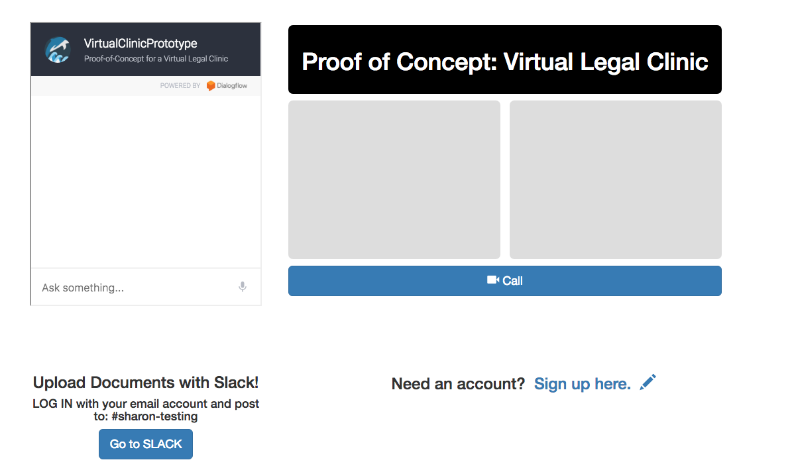
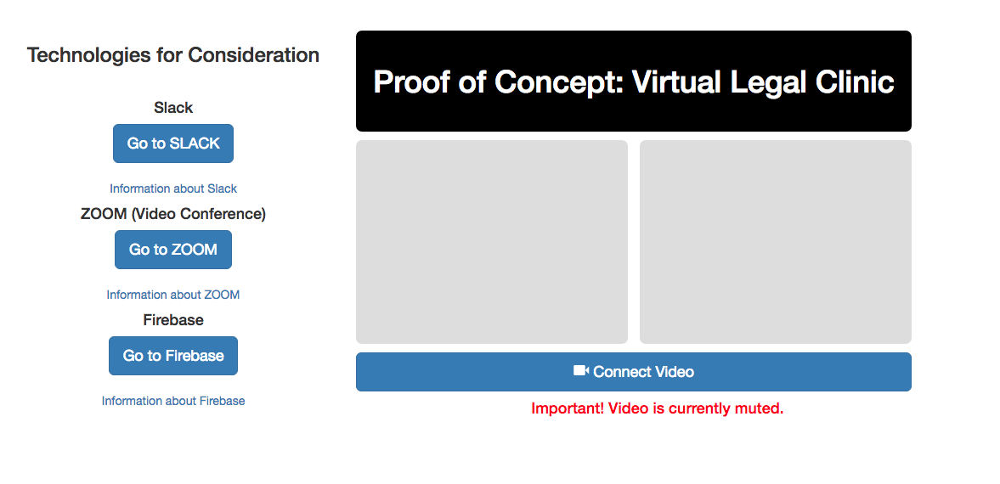
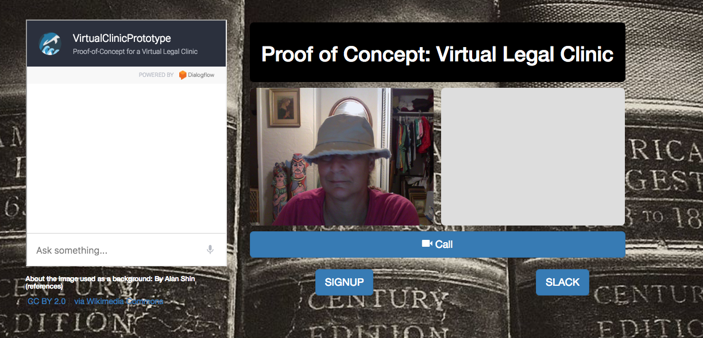

# sharon-launchcode.github.io
#### Proof of Concept: Explores potential methods of contact and communication for a Virtual Legal Clinic
#### Working with lawyers doing pro-bono work in an effort to use technology in order to bring legal assistance to those in need.
#### CURRENT STATUS: Work with lawyers on a platform for a Virtual Legal Clinic has been moved to a different platform, <a href="https://www.legaler.com/">Legaler</a> to use as a Virtual Clinic.  Legaler is an amazing platform, developed by lawyers. We were unaware of Legaler's presence when we first started working together; when we found out about Legaler,we unaminously decided to continue working together via the Legaler platform, rather than this one. 

#### As I continue to work with the amazing Legaler team as a non-lawyer "client" tester, I have since re-purposed this site to explore other technical challenges; namely, integration.   This project now continues independently of the work done with the Legaler team.

##### See BACKGROUND-INFORMATION.md for more information

#### PHASE ONE

##### Phase One of the Virtual Legal Clinic arose as a result of discussions at a Hackathon with lawyers trying to do pro-bono work.  One of the lawywers was trying to use Dialogflow as a chat mechanism in order to be able to assist youth aging out of foster care.  Another lawyer was trying to create a remote virtual video clinic for clients in remote locations.   In conversation, we found that each lawyer's need and technological solution could help the other lawyer.  The first phase was the initial model for doing so.

#### PHASE TWO

##### For Phase Two, the lawyer who wanted to assist youth aging out of foster care focused soley on the chat mechanism, although we all benefited from working with her and her team on the chat.   At that point, we focused our attention more heavily on the video components of the virtual clinic, and to remove the chat component.  

#### PHASE THREE

