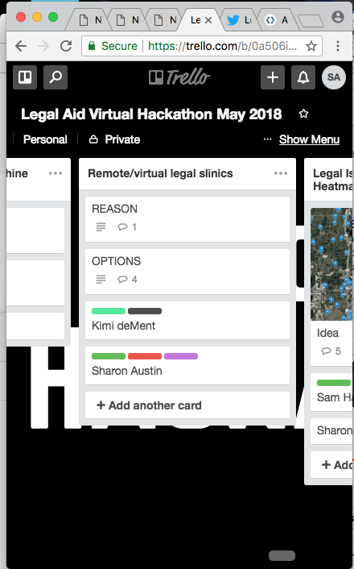
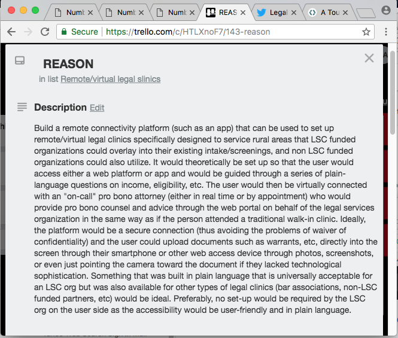

### About the use of Trello in the Legal Aid Hackathon 2018
##### https://trello.com/b/0a506isp/legal-aid-virtual-hackathon-may-2018

### Tasks for the Legal Hackathon were outlined and disseminated in Trello
##### Trello was used for Agile/Kanban purposes

##### In the screenshot above, we can see how the cards were used to set up projects and teams

##### In the screenshot above, the "wishlist" for the technology is set in the description.   I used this description to generate stories, epics, and tasks for the purpose of building the feature. 
